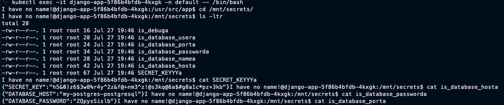
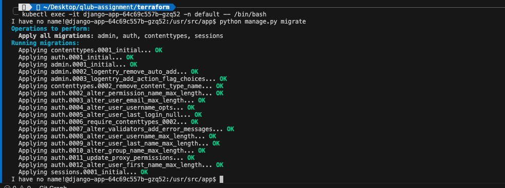
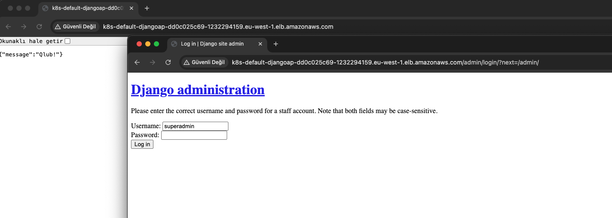
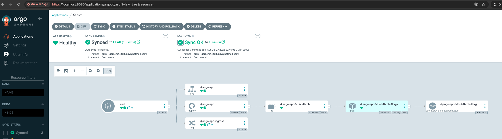
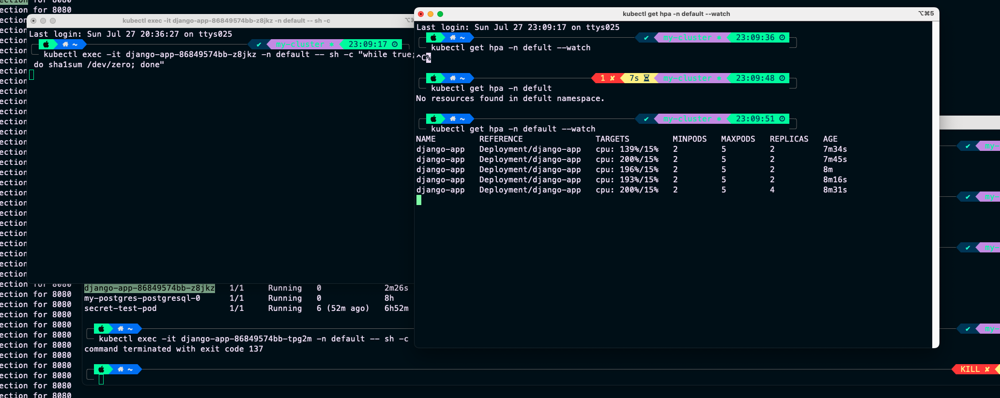
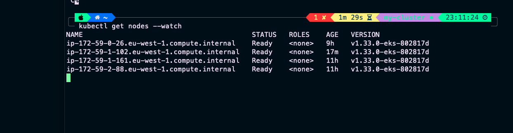

# Qlub App

## Terraform
### VPC, Subnets, Gateways, Route Tables everything related to VPC is created by Terraform VPC module
### Also environment variables are created by Terraform and stored in the Secrets Manager service
### EKS Cluster is created by Terraform EKS module 
### Policies are also created with Terraform
### In order to authenticate to the cluster Terraform Helm Provider is used.
### With that Cluster Autoscaler to scale nodes and Metrics Server to make HPA work is installed

## Application
### I updated the application code to read secrets from volume mount that refers to the secrets in Secrets Manager.
### Deployment is exposed as Deployment -> Service(ClusterIP) -> Ingress(AWS Load Balancer Controller)

## EKS
### I installed pgsql from bitnami chart, ran migrations and inserted some values inside the tables
### CSI secret store is installed for Secrets Manager
### ArgoCD is installed
### AWS Load Balancer Controller is installed in order to expose the application
### Some service accounts are created with AWS CLI, ekscstl inside the install_script.sh

## Application Deployment
### Created a Codebuild Project and buildspec.yml to get the Application code and Helm Chart from GitHub and built the Docker image and pushed it to Private ECR Repo.
### Also ArgoCD is authenticated with GitHub and arranged it to check the qlub-helm-chart path and turned on the auto sync so whenever the chart is updated it auto syncs the ArgoCD application.

# Secrets as volume mounts from Secrets Manager Service

# DB Migration

# Application UI and LB

# ArgoCD auto sync enabled

# HPA with the load

# Cluster Autoscaler
